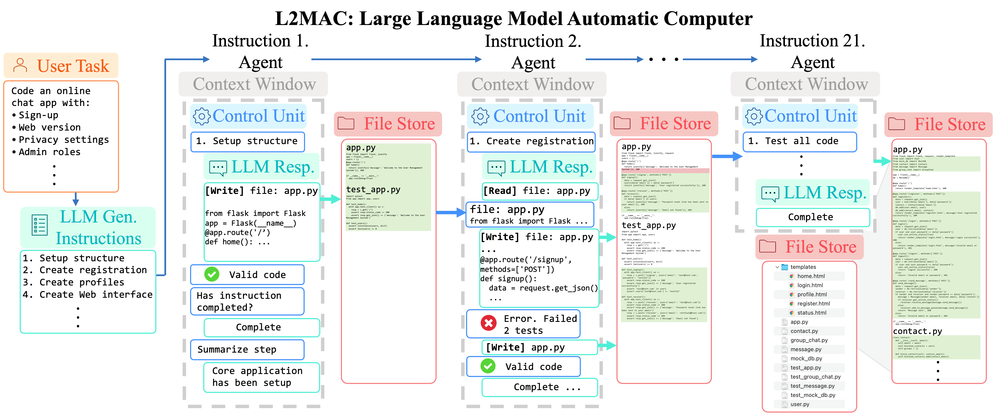
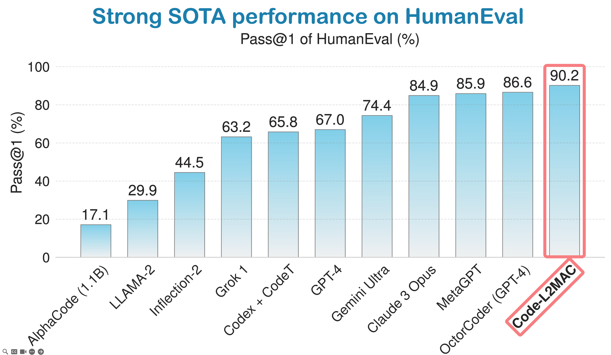
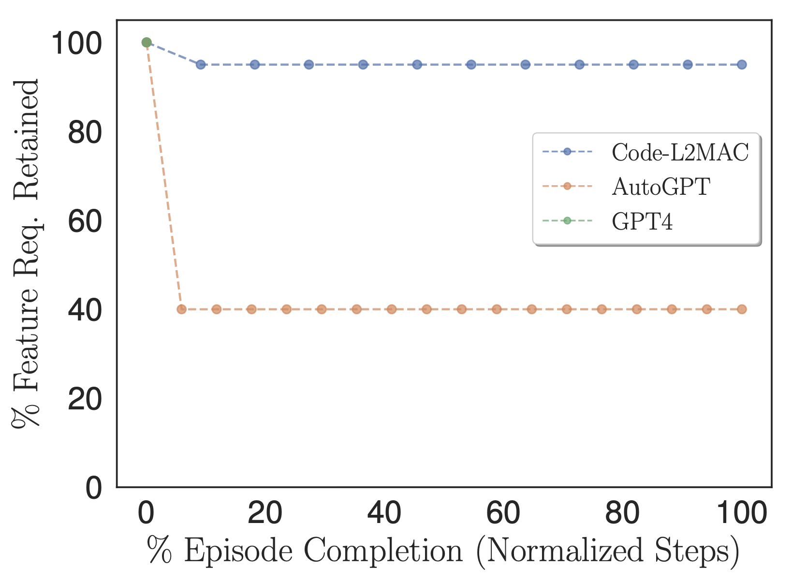
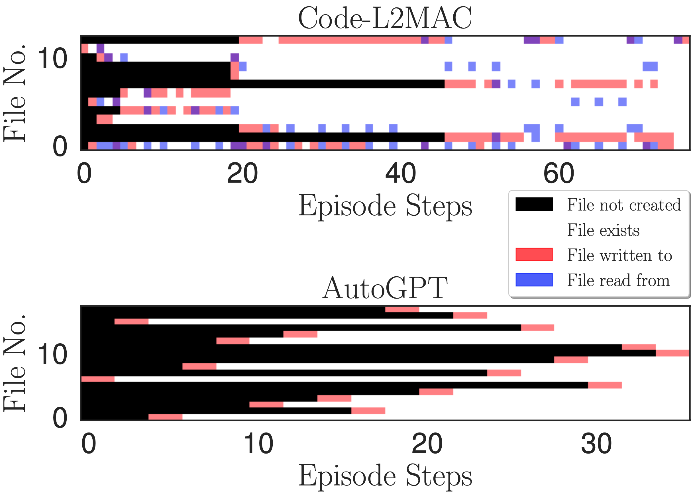
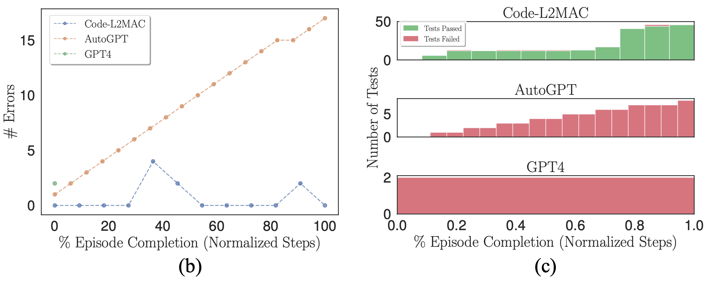
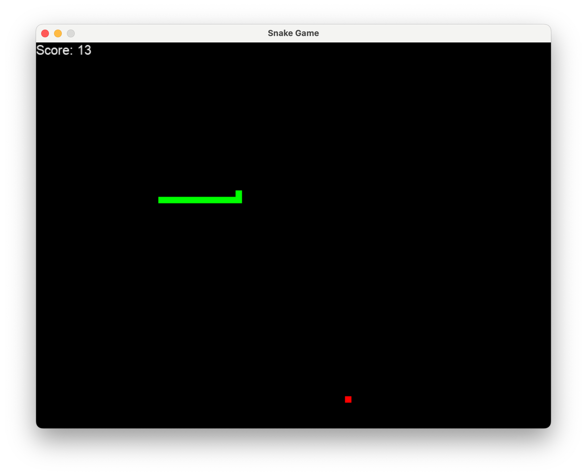
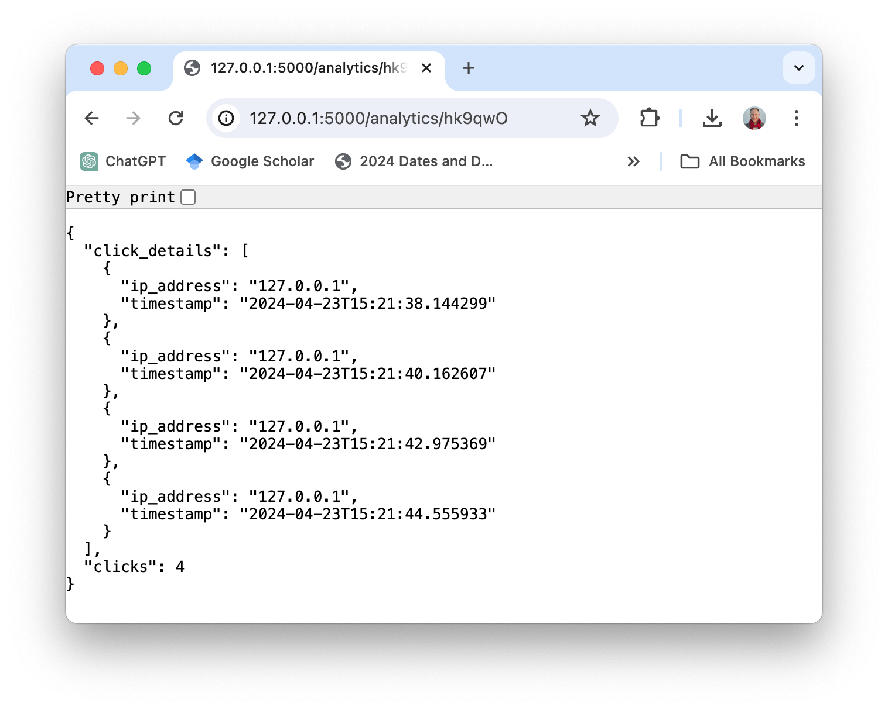
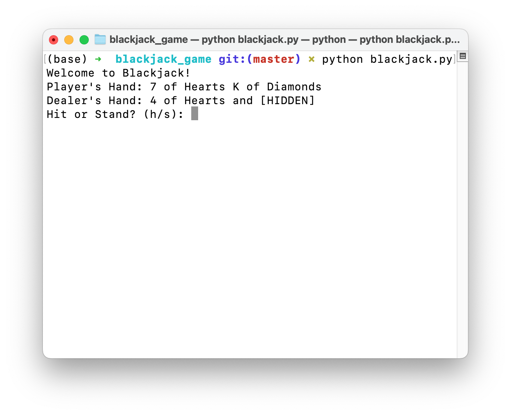

# L2MAC: The Large Language Model Automatic Computer Framework

<p align="center">
<a href=""></a>
</p>

<p align="center">
<b>Pioneering the first practical LLM-based general-purpose stored-program automatic computer (von Neumann architecture) framework in an LLM-based multi-agent system, for solving complex tasks through generating extensive and consistent outputs, unbounded by the LLMs fixed context window constraint.</b>
</p>

<p align="center">
<a href="https://opensource.org/licenses/MIT"></a>
<a href="docs/guide/roadmap.md"></a>
<a href="https://discord.gg/z27CxnwdhY"></a>
</p>

## News
🌟 May. 7 - 11th, 2024: We will present L2MAC at the International Conference on Learning Representations (ICLR) 2024. Come meet us at ICLR in Vienna Austria! Please reach out to me at sih31 (at) cam.ac.uk so we can meet, virtual meetings accepted as well!

🌟 April. 23, 2024: L2MAC is fully open-sourced with the initial version released.

🚀 Jan. 16, 2024: The paper [L2MAC: Large Language Model Automatic Computer for Extensive Code Generation
](https://arxiv.org/abs/2310.02003) is accepted for presentation at ICLR 2024!

## LLM-Automatic Computer (L2MAC) framework excels at solving large complex tasks, such as being state-of-the-art for generating large codebases, or it can even write entire books, all of which bypass the traditional constraints of the LLMs fixed context window constraint.

* LLM-Automatic Computer can take a **one line input prompt** and generate an extensive and large output, for example generating an entire complex codebase.
  * Internally, the LLM-Automatic Computer uses a **prompt-program** which is a series of prompts, each providing a instruction step to execute. Unless explicitly given, the **prompt-program** is self generated (bootstrapped) and executed. Specifically each instruction step of the **prompt-program** is loaded into a new LLM agent to execute, whose context is managed by a control unit and is provided with tools so that it can read and write to a persistent memory, here a file store, which contains the final and intermediate outputs. This enables it to automatically execute general-purpose prompt programs to solve complex tasks, that require extensive cohesive outputs, where the output is unbounded and not constrained by the LLMs underlying context window constraint.
  

<p align="center">LLM-Automatic Computer (L2MAC) instantiation for coding a large complex codebase for an entire application based on a <b>single user prompt</b>. Here we provide L2MAC with additional tools to check for any syntax errors within the code and run any unit tests if they exist.</p>

## Get Started

### Installation

> Ensure that Python 3.7+ is installed on your system. You can check this by using: `python --version`.
> You can use conda like this: `conda create -n l2mac python=3.9 && conda activate l2mac`

```bash
pip install --upgrade l2mac
# or `pip install --upgrade git+https://github.com/samholt/l2mac`
# or `git clone https://github.com/samholt/l2mac && cd l2mac && pip install --upgrade -e .`
```

For detailed installation guidance, please refer to [installation](https://samholt.github.io/L2MAC/guide/get_started/installation.html#install-stable-version)

### Configuration

You can init the config of L2MAC by running the following command, or manually create `~/.L2MAC/config.yaml` file:
```bash
# Check https://samholt.github.io/L2MAC/guide/get_started/configuration.html for more details
l2mac --init-config  # it will create ~/.l2mac/config.yaml, just modify it to your needs
```

You can configure `~/.l2mac/config.yaml` according to the [example](https://github.com/samholt/L2MAC/blob/master/config/config.yaml) and [doc](https://samholt.github.io/L2MAC/guide/get_started/configuration.html):

```yaml
llm:
  api_type: "openai"  # or azure etc. Check ApiType for more options
  model: "gpt-4-turbo-preview"  # or "gpt-4-turbo"
  base_url: "https://api.openai.com/v1"  # or forward url / other llm url
  api_key: "YOUR_API_KEY"
```

### Usage

After installation, you can use L2MAC CLI

```bash
l2mac "Create a beautiful, playable and simple snake game with pygame. Make the snake and food be aligned to the same 10-pixel grid."  # this will create a codebase repo in ./workspace
```

or use it as a library

```python
from l2mac import generate_codebase
codebase: dict = generate_codebase("Create a beautiful, playable and simple snake game with pygame. Make the snake and food be aligned to the same 10-pixel grid.")
print(codebase)  # it will print the codebase (repo) complete with all the files as a dictionary, and produce a local codebase folder in ./workspace
```

### [QuickStart](https://samholt.github.io/L2MAC/guide/get_started/quickstart.html)

## Tutorial

- 🗒 [Online Documentation](https://samholt.github.io/L2MAC/)
- 💻 [Usage](https://samholt.github.io/L2MAC/guide/get_started/quickstart.html)  
- 🔎 [What can L2MAC do?](https://samholt.github.io/L2MAC/guide/get_started/introduction.html)
- 🖼️ [Gallery of Examples Produced](https://samholt.github.io/L2MAC/guide/use_cases/gallery.html)
- 🛠 How to run L2MAC? 
  - [L2MAC Usage & Development Guide | L2MAC 101](https://samholt.github.io/L2MAC/guide/tutorials/l2mac_101.html)
- 🧑‍💻 Contribution
  - [Development Roadmap](https://samholt.github.io/L2MAC/guide/roadmap.html)
- 🔖 Use Cases
  - [Create a state-of-the-art large codebase](https://samholt.github.io/L2MAC/guide/use_cases/codebase_generator.html)
  - [Create an entire book](https://samholt.github.io/L2MAC/guide/use_cases/book_generator.html)
- ❓ [FAQs](https://samholt.github.io/L2MAC/guide/faq.html)

## Support

### Discord Join US

📢 Join Our [Discord Channel](https://discord.gg/z27CxnwdhY)! Looking forward to seeing you there! 🎉


### Contact Information

If you have any questions or feedback about this project, please feel free to contact us. We highly appreciate your suggestions!

- **Email:** sih31 at cam.ac.uk
- **GitHub Issues:** For more technical inquiries, you can also create a new issue in our [GitHub repository](https://github.com/samholt/L2MAC/issues).

We will respond to all questions within 2-3 business days.

## Citation

To stay updated with the latest research and development, follow [@samianholt](https://twitter.com/samianholt) on Twitter. 

To cite [L2MAC](https://openreview.net/forum?id=EhrzQwsV4K) in publications, please use the following BibTeX entry.

```bibtex
@inproceedings{
    holt2024lmac,
    title={L2{MAC}: Large Language Model Automatic Computer for Unbounded Code Generation},
    author={Samuel Holt and Max Ruiz Luyten and Mihaela van der Schaar},
    booktitle={The Twelfth International Conference on Learning Representations},
    year={2024},
    url={https://openreview.net/forum?id=EhrzQwsV4K}
}
```

## How does L2MAC compare against AutoGPT, GPT-4 and existing methods?


<p align="center">LLM-Automatic Computer (L2MAC) instantiation for coding a large complex codebase for an entire application based on a <b>single user prompt</b>. Codebase generation system design task results showing the percentage of functional features specified that are fully implemented (<b>Features %</b>), the number of syntactical errors in the generated code (<b># Errors</b>), the number of lines of code (<b>LOC</b>), and the number of passing tests (<b>Tests Passed</b>). L2MAC fully implements the highest percentage of user-specified task feature requirements across all tasks by generating fully functional code that has minimal syntactical errors and a high number of passing self-generated unit tests, therefore it is <i>state-of-the-art</i> for the generation of large output codebases, and similarly competitive for the generation of large output tasks. The results are averaged over 10 random seeds.</p>

1. L2MAC fully implements the highest percentage of user-specified task feature requirements across all system design tasks in the paper (with one being shown above) by generating fully functional code that has minimal syntactical errors and a high number of passing self-generated unit tests—therefore, [L2MAC is state-of-the-art for completing these system design large codebase generation benchmark tasks.](https://openreview.net/pdf?id=EhrzQwsV4K).
2. We further evaluated L2MAC on the standard **HumanEval benchmark** and observe that it achieves a state-of-the-art score of [90.2% Pass@1](https://paperswithcode.com/sota/code-generation-on-humaneval).
3. L2MAC also works for general-purpose extensive text-based tasks, such as writing an [entire book from a single prompt](https://samholt.github.io/L2MAC/guide/use_cases/gallery.html#entire-book-italian-pasta-recipe-book).


<p align="center">LLM-Automatic Computer (L2MAC) achieves strong performance on HumanEval coding benchmark and is currently ranked the <b>3rd best AI coding agent in the world</b> on the global coding <a href="https://paperswithcode.com/sota/code-generation-on-humaneval">industry-standard leaderboard of HumanEval</a>.</p>

### In depth-comparison to AutoGPT and GPT-4

#### Can L2MAC correctly perform task-oriented context management?


<p align="center">Percentage of user-specified feature requirements that are retained within the methods task instructions and used in context.</p>

To explore if the benchmarked methods during operation contain the information within their context to complete the task directly, we adapted our *Features %* metric to count the number of user-specified task feature requirements that are retained within the methods task instructions instead, i.e., those instructions that are eventually fed into its context window during its operation, as shown in the above figure.
Empirically, we observe that L2MAC is able to retain a high number of user-specified task feature requirements within its *prompt program* and perform instruction-oriented long-running tasks.
We note that AutoGPT also initially translates the user-specified task feature requirements into task instructions; however, it does so with higher compression—condensing the information into a mere six-sentence description. This process results in the loss of crucial task information necessary for completing the overall task correctly, such that it aligns with the detailed user-specified task.


#### Can Code-L2MAC perform precise read/write operations for the entire file store?


<p align="center">Heatmap of file access. Indicating reading, writing, and when files are created at each write operation step during one episode for the Online Chat App task.</p>

We wish to understand, during the operation of executing a task instruction, if L2MAC can understand the existing generated code files within the codebase---which could have been created many instructions ago, and through its understanding, create new files that interrelate with the existing files, and most importantly update existing code files as new features are implemented.
To derive insight, we plot a heatmap of the reading, writing, and when files are created at each write operation step during one episode in the above figure.
We observe that L2MAC has an understanding of the existing generated code that allows it to update existing code files, even those originally created many instruction steps ago, and can view the files when it is not certain and update the files through writing to the files.
In contrast, AutoGPT often only writes to files once, when initially creating them, and can only update files that it knows about that are retained within its current context window. Although it also has a read file tool, it often forgets about the files that it created many iterations ago due to its context window handling approach of summarizing the oldest dialog messages in its context window, i.e., a continual lossy compression of the previous progress made during operation of completing the task.

#### Can L2MAC check the generated output and error correct?


<p align="center"><b>(b)</b> Number of syntactical errors within the codebase. <b>(c)</b> Stacked histograms of passing and failing self-generated unit tests.</p>

When using a probabilistic model (LLM) as a generator to output code, errors can naturally occur in its outputs. Therefore, we wish to verify if, when errors do appear, the respective benchmark methods can error-correct the codebase. We plot the number of syntactical errors in the codebase during a run where errors are made in the above **figure (b)**. We observe that L2MAC can correctly error correct the previously generated codebase that has errors contained within, which could arise from syntactical errors from the last file written or other files that depend on the most recent file written, which now contain errors.
It does this by being presented with the error output when it does arise and modifying the codebase to resolve the error whilst still completing the current instruction.
In contrast, AutoGPT cannot detect when an error in the codebase has been made and continues operating, which can compound the number of errors forming within the codebase.

Moreover, L2MAC generates unit tests alongside the functional code and uses these as an error checker to inspect the functionalities of the codebase as it is generated and can use these errors to fix the codebase to pass unit tests that now fail after updating part of an existing file. We show this in the above **figure (c)** and observe that AutoGPT, whilst prompted to also write unit tests for all code generated, is unable to use these tests as an integrity error check, which could be compounded by the observation that AutoGPT forgets which files it has previously created and hence unable to modify the existing forgotten code files as new modifications are made, leading to incompatible code files.

#### Summary

We present L2MAC, the first LLM-based general-purpose stored-program computer framework that effectively and scalably augments LLMs with a memory store for long output generation tasks where this was not previously successfully achieved. Specifically, L2MAC, when applied for long code generation tasks, surpasses existing solutions—and is an immensely useful tool for rapid development. We welcome contributions and encourage you to use and cite the project. Click here to get [started](https://samholt.github.io/L2MAC/).

# Gallery of Examples

We include a gallery of example applications entirely produced by the LLM Automatic Computer (L2MAC) from a single input prompt. L2MAC excels at solving large complex tasks, such as being state-of-the-art for generating large codebases, or it can even write entire books, all of which bypass the traditional constraints of the LLMs fixed context window constraint.

## Playable Snake Game

Just type `l2mac "Create a beautiful, playable and simple snake game with pygame. Make the snake and food be aligned to the same 10-pixel grid."`, you would get a complete codebase for a fully playable game, as shown here.

[](https://github.com/samholt/L2MAC/tree/master/docs/generated_examples/snake_game)

Click here for the complete files on [github](https://github.com/samholt/L2MAC/tree/master/docs/generated_examples/snake_game) or [download them here](docs/public/snake_game.zip). The code and prompt to generate this is [here](https://github.com/samholt/L2MAC/blob/master/examples/generate_codebase_simple_playable_snake.py).

## Large Complex URL Shortener Web Application

[](https://github.com/samholt/L2MAC/tree/master/docs/generated_examples/url_shortener_web_application)

[](https://github.com/samholt/L2MAC/tree/master/docs/generated_examples/url_shortener_web_application)

Click here for the complete files on [github](https://github.com/samholt/L2MAC/tree/master/docs/generated_examples/url_shortener_web_application) or [download them here](docs/public/url_shortener_web_application.zip). The code and prompt to generate this is [here](https://github.com/samholt/L2MAC/blob/master/examples/generate_codebase_complex_url_shortener_app.py).


## Entire Book | Italian Pasta Recipe Book

Just give L2MAC the prompt of `Write a complete recipe book for the following book title of "Twirls & Tastes: A Journey Through Italian Pasta". Description: "Twirls & Tastes" invites you on a flavorful expedition across Italy, exploring the diverse pasta landscape from the sun-drenched hills of Tuscany to the bustling streets of Naples. Discover regional specialties, learn the stories behind each dish, and master the art of pasta making with easy-to-follow recipes that promise to delight your senses.` and it can generate a complete 26-page length book automatically.

[](https://samholt.github.io/L2MAC/TwirlsAndTastesAJourneyThroughItalianPasta.pdf)

Click here for the [complete book](https://samholt.github.io/L2MAC/TwirlsAndTastesAJourneyThroughItalianPasta.pdf); L2MAC produced all the text for the book, and all images were created with DALLE.

The complete output text files are on [github](https://github.com/samholt/L2MAC/tree/master/docs/generated_examples/italian_pasta_recipe_book); you can [download them here](docs/public/italian_pasta_recipe_book.zip). The code and prompt to generate this is [here](https://github.com/samholt/L2MAC/blob/master/examples/generate_book.py).


## Playable Blackjack CLI Game

[](https://github.com/samholt/L2MAC/tree/master/docs/generated_examples/blackjack_game)

Click here for the complete files on [github](https://github.com/samholt/L2MAC/tree/master/docs/generated_examples/blackjack_game) or [download them here](docs/public/blackjack_game.zip). The code and prompt to generate this is [here](https://github.com/samholt/L2MAC/blob/master/examples/generate_codebase_simple_blackjack.py).

## Contribute Your Own Created Applications

We are actively looking for you to upload your own awesome applications here by submitting a PR with the application you made, sharing it with a GitHub issue, or sharing it on the [Discord channel](https://github.com/samholt/l2mac).